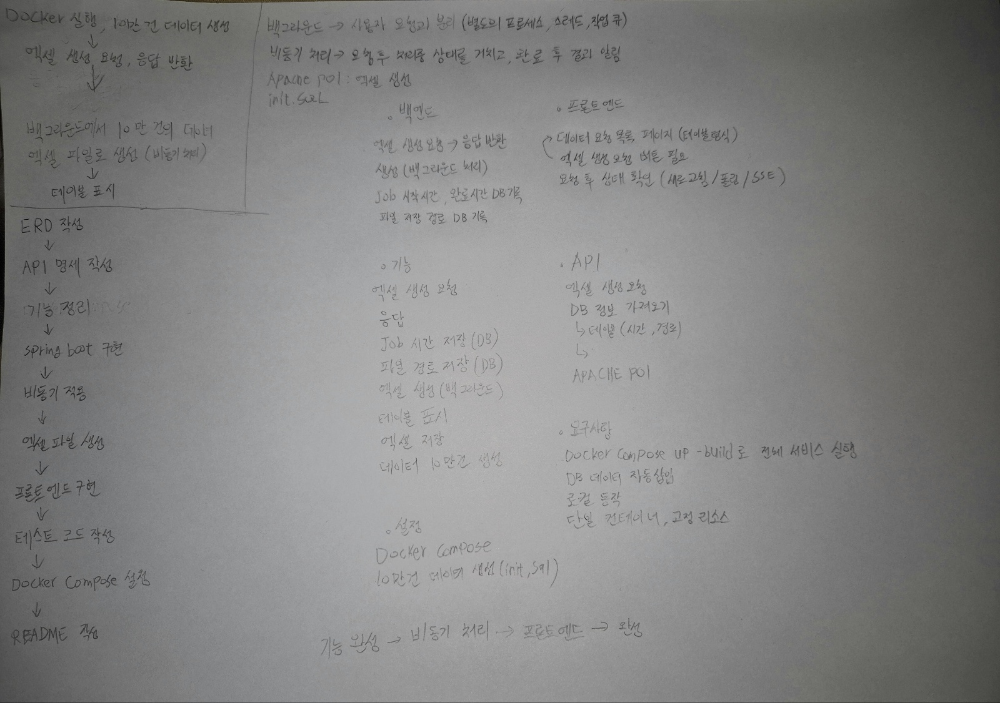

## ps-excel-system

------

## 1. 프로젝트 개요.

### 목표 

사용자의 엑셀 생성 요청에 즉시 응답하고 실제 엑셀 생성은 백그라운드에서 수행하는 비동기 엑셀 생성 시스템 구현

### 주요 기능
* 엑셍 생성 요청 API
* 작업 상태 조회 API
* 비동기 엑셀 생성
* 작업 상태 관리
* 10만 건 데이터 기반 엑셀 생성

------

## 2. 기술 스택

  

### Backend

* Java 24
* Spring Boot
* Spring Data JPA
 
### DB
* PostgreSQL
 
### Excel
* Apache POI SXSSFWorkBook
 
### Container
* Docker
* Docker Compose
 
### Frontend
* HTML
* JavaScript
 
### 선택 이유

Spring Boot
REST API 구현과 비동기 처리(@Async), JPA를 활용한 데이터 관리가 용이하여 선택하였습니다.

PostgreSQL
init.sql을 이용한 데이터 삽입이 빠르고 대용량 데이터 처리에 적합, Docker 환경에서 쉽게 구성할 수 있어서 선택하였습니다.

SXSSFWorkbook
10만 건 이상의 데이터를 처리할 때 메모리 사용량을 줄일 수 있는 스트리밍 기반 Excel 생성 기능을 제공하여 선택하였습니다.

HTML + JavaScript
빠르게 프론트엔드를 구성할 수 있고, 이를 통해서 백엔드 기능을 확인하기 용이하다고 생각되어 선택하였습니다.

-----

## 3. 시스템 구조
사용자

 ↓
 
POST /api/excel

 ↓
 
ExcelService

 ↓
 
DB 저장 (PENDING)

 ↓
 
즉시 응답

====================

ExcelGenerationService (@Async)

 ↓
 
PROCESSING

 ↓
 
Excel 생성

 ↓
 
DONE

------
## 4. 실행 방법

1. 프로젝트 클론
2. env 파일 설정
3. Docker 실행  
   Docker Compose up --build
4. http://localhost:8080 접속
   

-----
## 5. API

엑셀 생성
POST /api/excel

  {  
      "id": 5,  
      "status": "PENDING",  
      "requestedAt": "2026-06-03T08:47:05.567825602",  
      "startedAt": null,      
      "finishedAt": null,    
      "filepath": null    
  }

작업 조회
GET /api/excel

  {  
        "id": 4,        
        "status": "DONE",        
        "requestedAt": "2026-06-03T08:42:05.693738",        
        "startedAt": "2026-06-03T08:42:16.887438",        
        "finishedAt": "2026-06-03T08:42:23.61288",        
        "filepath": "files/excel_4.xlsx"        
  }

------

## 6. 설계 시 고민한 점

1) 사용자 응답과 실제 작업 수행 분리
   엑셀 생성에 시간이 걸리고, 비동기 처리를 적용해야 하므로 이를 설정할 방법을 생각해보았습니다.
2) 작업 상태 관리
   작업 진행 상황에 대해서, 테스트 코드를 작성해서 확인하며 어떻게 관리할 수 있을지 생각해보았습니다. 기능의 동작을 확인한 후, 각각의 작업의 상태를 알아야 하기에 이를 비동기 처리를 적용하여 반환할 수 있도록 하였습니다.
3) 엑셀 대용량 데이터 처리
   10만 건의 데이터 처리 및 엑셀 생성을 위해 SXSSFWorkbook을 사용하였습니다. 100개의 행을 메모리에 유지하고 나머지는 디스크에 기록하는 스트리밍 방식을 이용, 메모리 사용량을 줄이는 방식을 선택할 수 있었습니다.
4) 동시 요청
   ThreadPoolTaskExecutor를 사용, 여러 사용자의 요청을 동시에 처리할 수 있도록 구성하였습니다. ThreadPool을 이용하여, 요청을 한번에 처리할 수 있도록 하고, 조건에 맞게 작업을 관리할 수 있다는 점이 장점이라 생각하여 선택하였습니다. Thread를 적용하여 동시 작업 수를 제한하고, 사용량을 점검하였습니다.
5) Transational
   초기에는 @Transactional을 활용했으나, 기능에 대해서 엑셀을 요청하면 PENDING 상태만 저장되고, 비동기 스레드에서 조회할 수 없었습니다. 또한 PROCESSING 과정을 확인할 수 없었기에 트랜잭션 커밋을 제거하고, 비동기 작업을 별도의 흐름으로 동작하도록 하여 상태를 사용자가 쉽게 알 수 있도록 하였습니다.
6) 실시간 폴링
   상태 갱신 방법으로 페이지 새로고침, 폴링, SSE 중에서 폴링을 선택하였습니다. 작업 상태 조회가 목적이고, 2초 간격 조회로 요구사항을 만족할 수 있을 것이라 판단하여 선택하였습니다.
  
  
  
-----
## 7. 테스트

테스트 코드를 작성하여 기능에 대한 점검을 하였습니다.  
* 상태 변경 테스트
* Service 테스트
* Controller 테스트

-----
## 8. 기록

동작 화면  

설계 과정 메모  

  

  
